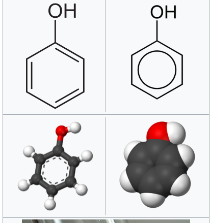

# Informatie posterdag

## Introductie

Hierbij de info mbt de posterdag.

>Waarschuwing: fenol geeft brandwonden

- item 1
- item 2
- item 3

Dit is een [link](https://en.wikipedia.org/wiki/Phenol) naar Wikipedia.

Hierbij een plaatje:

1. item 1
2. item 2
3. item 3
4. item 4

Dit is een extra zin.

Dit is **vet**.
Kan ook met html. Dit is <b>vet</b>.

paars

$\lambda = \frac{x}{y} \cdot \sum x_{i-j}$

$abc = \frac{x^3 - y^3}{x-1}$

    

